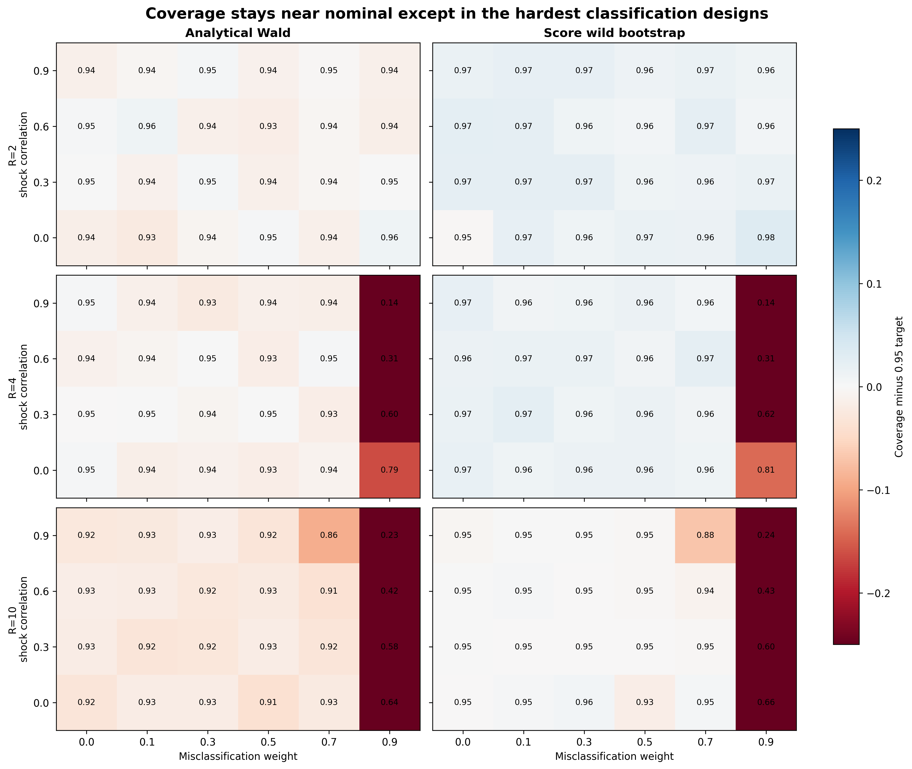
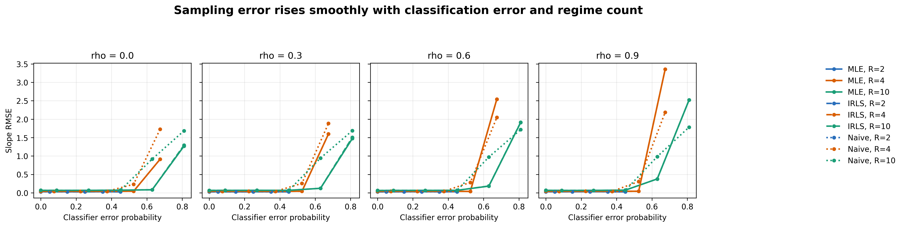
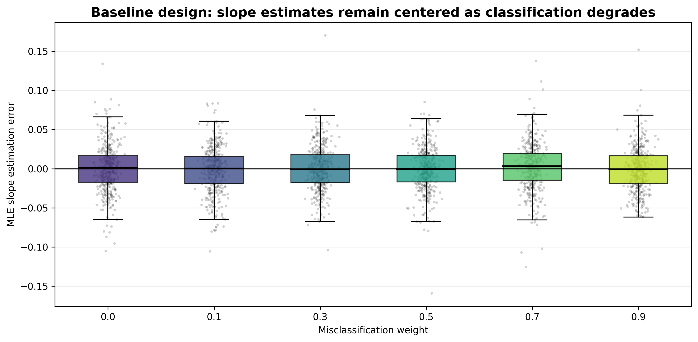
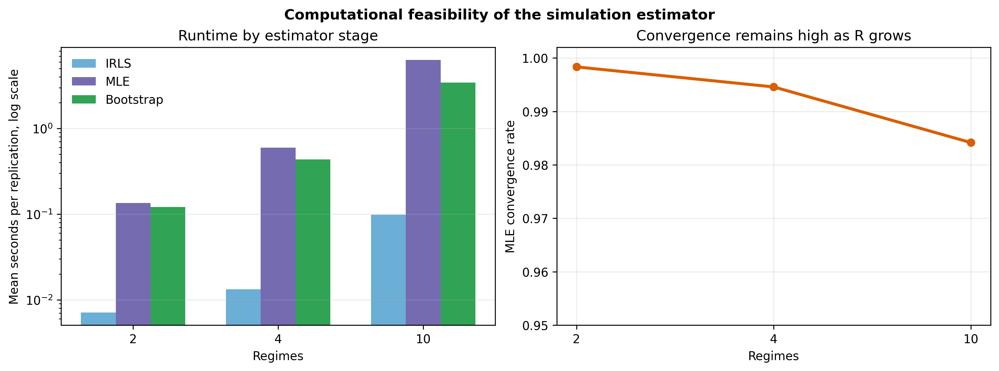

# Correcting Machine-Learned Regime Misclassification in Switching Regressions

Aleksandr Michuda

Draft v1: 2026-04-27

## Abstract

Machine-learning classifiers are increasingly used to assign observations to economic states, locations, demographic groups, and other regimes that are then used in downstream regressions. When those predicted regimes are treated as true, classification error becomes an econometric measurement-error problem. This paper studies a switching-regression estimator that uses the classifier's soft predictions and a confusion matrix to correct for regime misclassification. An EM-style IRLS routine provides stable starting values, and full maximum likelihood provides standard errors and confidence intervals. In a 72-cell Monte Carlo design with 200 replications per cell, the estimator has near-nominal coverage under moderate classifier error: for misclassification weights up to 0.7, average slope coverage is 0.936 for analytical Wald intervals and 0.959 for score wild bootstrap intervals. Performance deteriorates sharply only when many-regime classifiers are nearly uninformative. The results suggest a practical rule for applied work: use classifier probabilities and validation-data confusion matrices directly, but report classifier signal and stress-test inference when the number of regimes is large.

## 1. Introduction

Machine-learning predictions increasingly enter empirical economics as intermediate data products rather than as final objects of interest. A researcher may predict ethnicity from names, occupations from text, neighborhoods from geocodes, or platform-worker locations from noisy digital traces. These predictions are then used to define treatment status, subgroup membership, or the regime in which a structural relationship is estimated. This workflow is useful because it converts unstructured data into econometric variables, but it also creates a familiar problem in a new form: the regressor or regime indicator is measured with error.

This paper studies that problem for switching regressions. The motivating setting is a panel in which each worker, driver, or unit belongs to one latent regime, and the slope of an outcome on a regime-specific shock differs across regimes. The econometrician does not observe the true regime. Instead, a classifier produces a soft probability vector over predicted regimes, and validation data provide a confusion matrix. The question is how to use those objects in a regression model without pretending that predicted labels are true labels.

The proposed approach is direct. The classifier probabilities and the confusion matrix imply, for each observation or driver, a probability distribution over latent true regimes. Those probabilities enter a finite-mixture switching-regression likelihood. The estimator first runs an EM-style iteratively reweighted least squares routine, which alternates between posterior regime weights and weighted least-squares coefficient updates. It then uses the IRLS solution to initialize a full maximum-likelihood estimator. The maximum-likelihood step is the primary estimator because it delivers likelihood-based standard errors and supports score wild bootstrap inference.

The paper is simulation-only. The simulation design is calibrated to the structure of a ride-hailing application in which workers respond to region-specific weather shocks and region assignment may be inferred from machine-learning predictions. The goal is not to re-estimate that application here. Instead, the goal is to document when the classifier-informed likelihood behaves well and when it does not. This is the practical question an applied researcher faces before using a classifier-generated regime variable in a switching regression.

The Monte Carlo varies three features that should matter for inference. First, it varies the quality of the classifier. The misclassification weight ranges from zero, which corresponds to perfect classification, to 0.9, which corresponds to a classifier close to uninformative in many-regime designs. Second, it varies the number of regimes: two, four, and ten. Third, it varies the correlation among regime-specific shocks, because highly correlated regressors make it harder to distinguish regime-specific slopes. Each cell has 200 replications with 200 drivers and 15 periods per replication.

The results are encouraging but not unconditional. Under moderate misclassification, the estimator delivers coverage close to the nominal 95 percent target. Averaging over cells with misclassification weight at most 0.7, slope coverage is 0.936 for analytical Wald intervals and 0.959 for score wild bootstrap intervals. Mean MLE slope RMSE in those moderate designs is 0.029 with two regimes, 0.041 with four regimes, and 0.092 with ten regimes. These results support the basic feasibility of likelihood correction when the classifier still contains meaningful signal.

The stress tests are equally important. In the hardest cells, coverage collapses. With four regimes, shock correlation 0.9, and misclassification weight 0.9, bootstrap coverage is 0.142. With ten regimes, shock correlation 0.9, and misclassification weight 0.9, bootstrap coverage is 0.242. These cells are not representative moderate errors: a misclassification weight of 0.9 implies correct-class probability of only 0.325 for four regimes and 0.19 for ten regimes. The lesson is not that the estimator fails generally. The lesson is that many-regime switching regressions cannot be rescued by likelihood correction when the classifier is nearly uninformative.

The paper contributes to three literatures. First, it builds on the switching-regression tradition beginning with Quandt (1972), Goldfeld and Quandt (1973), and Hamilton (1989), but it treats regime information as coming from an external classifier rather than from an entirely latent transition process. Second, it connects to the econometric literature on misclassification, including Aigner (1973), Bollinger (1996), Mahajan (2006), and Lewbel (2007). Third, it fits into the modern post-machine-learning econometrics agenda surveyed by Athey and Imbens (2019) and formalized in other contexts by Chernozhukov et al. (2018). The distinctive feature here is that the machine-learning object is a predicted latent regime, and the downstream model is a switching regression.

The rest of the paper proceeds as follows. Section 2 presents the model and the mapping from classifier output to latent-regime probabilities. Section 3 describes estimation and inference. Section 4 lays out the Monte Carlo design. Section 5 presents the simulation results. Section 6 discusses practical implications and limitations. Section 7 concludes.

## 2. Model

Consider a panel indexed by units `i = 1, ..., N` and time periods `t = 1, ..., T`. Each unit belongs to one latent regime `r_i` in `{0, ..., R - 1}`. In the motivating application, regimes can be interpreted as geographic or demographic groups inferred from noisy information. The econometric relationship of interest is regime specific:

```math
y_{it} = alpha_{r_i} + beta_{r_i} x_{r_i t} + epsilon_{it},
```

where `x_{rt}` is the shock relevant for regime `r`, `alpha_r` and `beta_r` are regime-specific parameters, and `epsilon_it` is an idiosyncratic error. The simulation uses a common error variance across regimes. The key econometric problem is that `r_i` is not observed.

Instead of observing the true regime, the econometrician observes the output of a classifier. Let `p_i` denote the classifier's soft probability vector over predicted regimes. Its `j`th element is the classifier's probability that the unit is predicted to be in class `j`. The classifier is imperfect, but suppose validation data or a known simulation design provide a confusion matrix. In the simulation code, the matrix `mw` is row-stochastic, with element `mw[true, predicted] = P(predicted | true)`. The estimator uses the column-normalized version:

```math
cm[k,j] = P(true = k | predicted = j).
```

Combining the soft predicted probabilities with this column-normalized confusion matrix gives a probability over true regimes:

```math
w_i(k) = sum_j p_i(j) cm[k,j].
```

These `w_i(k)` are not estimated inside the regression. They are precomputed from classifier output and validation-data error rates. The switching regression then treats true regime membership as latent but probabilistically informed by the classifier.

When regime membership is fixed within a unit, the appropriate likelihood marginalizes over the unit's latent regime after multiplying the unit's time-series likelihood contributions. For unit `i`, the likelihood is

```math
L_i(theta) = sum_{r=0}^{R-1} w_i(r) prod_{t=1}^{T_i} f(y_{it} | alpha_r, beta_r, sigma),
```

where `theta` collects all regime-specific coefficients and the common scale parameter. This driver-level likelihood differs from an observation-level mixture likelihood that would allow the same unit to switch regimes across periods. The simulation harness passes driver identifiers into the estimator so the likelihood respects the fixed-regime panel structure.

This model highlights the role of the classifier. If the classifier is highly informative, `w_i(k)` is concentrated near the true regime, and the likelihood is close to the complete-data likelihood. If the classifier is uninformative, `w_i(k)` becomes diffuse, and the model must distinguish regimes using outcome patterns and regime-specific shocks alone. The Monte Carlo evidence below is organized around this signal-strength dimension.

## 3. Estimation and Inference

The estimator uses two computational steps. The first is an EM-style IRLS algorithm. Given current parameter values, the E-step computes posterior probabilities that each observation or driver belongs to each regime. Given those posterior probabilities, the M-step solves weighted least-squares problems for the regime-specific regression coefficients and updates the common variance. This routine is fast and stable, making it useful for initialization.

The second step is full maximum likelihood. The IRLS estimates are stacked into a starting vector for the likelihood optimizer. The MLE is the paper's primary estimator because it directly optimizes the observed-data likelihood and provides a Hessian-based covariance estimate. The implementation also computes score wild bootstrap intervals, clustering at the independent unit level when driver-level likelihood is used.

This division of labor is important. IRLS is not presented as a separate preferred estimator; it is an algorithmic bridge to the MLE. In the Monte Carlo results, IRLS and MLE have nearly identical point-estimate RMSE. Across all design cells, mean slope RMSE is 0.264 for IRLS and 0.263 for MLE. The practical value of the MLE is inference: it delivers standard errors and confidence intervals that can be evaluated in coverage experiments.

Two confidence intervals are evaluated. The first is the analytical Wald interval based on the MLE standard error. The second is a score wild bootstrap interval. The bootstrap is designed to be robust to clustered score contributions and is especially relevant because the latent regime is fixed at the driver level. In the figures and tables below, coverage is computed for slope coefficients, which are the main objects of interest.

## 4. Monte Carlo Design

The Monte Carlo design follows the simulation notebook `examples/monte_carlo_coverage.py` and the cached outputs in `mc_coverage_results/`. Each replication generates a panel with 200 drivers and 15 time periods. The number of latent regimes is `R in {2, 4, 10}`. True intercepts and slopes vary by regime. For two regimes, the true slopes are 3.0 and -2.0; for four regimes, they are 3.0, -2.0, 1.5, and -1.0; for ten regimes, they range linearly from 3.0 to -2.0. The error standard deviation is one in every regime.

The design varies classifier quality through a misclassification weight `w`. When `w = 0`, the classifier is perfect. As `w` rises, probability mass moves from the true class to incorrect classes. The mapping from weight to correct-class probability is

```math
P(correct) = 1 - w(1 - 1/R).
```

This mapping matters because the same `w` implies different signal levels for different numbers of regimes. At `w = 0.9`, correct-class probability is 0.55 for two regimes, 0.325 for four regimes, and 0.19 for ten regimes. The high-weight many-regime cells are therefore extreme weak-classifier stress tests.

The design also varies the equicorrelation among regime-specific shocks, `rho in {0.0, 0.3, 0.6, 0.9}`. Correlated shocks make regime-specific slopes harder to distinguish. A high-correlation, high-misclassification, many-regime cell is therefore the hardest case for the estimator.

There are 72 design cells: three regime counts, six misclassification weights, and four shock correlations. Each cell has 200 replications. Each replication records IRLS estimates, MLE estimates, analytical standard errors, score wild bootstrap intervals, convergence indicators, and runtime. The generated paper artifacts are reproducible from `paper-writer/scripts/generate_simulation_evidence.py`. Exact table versions are in Appendix Tables A0-A3.

## 5. Results

### 5.1 Coverage

Figure 1 is the main coverage result. It plots, for each regime count, the gap between empirical coverage and the 0.95 target. The left column reports analytical Wald coverage, and the right column reports score wild bootstrap coverage. Each heatmap varies misclassification weight on the horizontal axis and shock correlation on the vertical axis.



The first result is that coverage is close to nominal through a wide middle range of the design. For cells with `w <= 0.7`, average slope coverage is 0.936 for analytical Wald intervals and 0.959 for score wild bootstrap intervals. This result holds despite variation in regime count and shock correlation. The bootstrap is slightly conservative on average, which is visible in several cells with coverage above 0.95.

The second result is that coverage failure is concentrated in the extreme high-misclassification, many-regime cells. Across all design cells, average analytical Wald coverage is 0.884 and average bootstrap coverage is 0.906. The drop from the moderate-design averages is driven primarily by `w = 0.9`. Averaging over regime counts and correlations, bootstrap coverage is 0.640 at `w = 0.9`, compared with at least 0.953 for each lower weight.

The third result is that two-regime designs remain well behaved even at high `w`. With `R = 2` and `rho = 0`, bootstrap coverage ranges from 0.948 to 0.982 across the misclassification grid. At `R = 2`, even `w = 0.9` leaves correct-class probability at 0.55. The classifier is noisy, but not essentially useless. By contrast, at `R = 4` and `w = 0.9`, correct-class probability is 0.325; at `R = 10`, it is 0.19. The coverage collapse in these cells is therefore an identification warning about high-dimensional regime models with weak classifiers.

The hardest cells are instructive. With `R = 4`, `rho = 0.9`, and `w = 0.9`, analytical Wald coverage is 0.138 and bootstrap coverage is 0.142. With `R = 10`, `rho = 0.9`, and `w = 0.9`, analytical Wald coverage is 0.230 and bootstrap coverage is 0.242. In these designs, the classifier provides little information and the shocks are highly correlated, so the likelihood has limited independent variation with which to distinguish regimes.

### 5.2 RMSE and bias

Figure 2 summarizes point-estimate accuracy. It plots slope RMSE against classifier error probability, separating panels by shock correlation and lines by estimator and regime count.



The RMSE pattern mirrors the coverage result. In moderate designs, the estimator is accurate. For `w <= 0.7`, mean MLE slope RMSE is 0.029 for `R = 2`, 0.041 for `R = 4`, and 0.092 for `R = 10`. These values increase with regime count, as expected, but they remain small relative to the range of true slopes in the simulation.

At `w = 0.9`, RMSE rises sharply for the high-regime designs. With no shock correlation, MLE slope RMSE is 0.913 for `R = 4` and 1.268 for `R = 10`. With shock correlation 0.9, MLE slope RMSE is 3.357 for `R = 4` and 2.520 for `R = 10`. The fact that these failures appear both in RMSE and coverage is useful: the problem is not merely a standard-error calibration issue. It is a weak-classification problem that affects point estimation.

IRLS and MLE are nearly indistinguishable in the RMSE frontier. This supports the computational strategy used in the paper. IRLS is a good initializer and a useful diagnostic, but the MLE is retained as the primary estimator because it provides the inference objects evaluated in Figure 1.

Figure 3 focuses on the baseline two-regime, uncorrelated-shock design. It shows the distribution of MLE slope errors across the misclassification grid.



The distributions remain centered near zero. This visual is important because it explains why coverage remains strong in the two-regime design. Misclassification increases uncertainty, but with enough classifier signal and a correctly specified confusion matrix, it does not necessarily introduce systematic slope bias in the corrected likelihood estimator.

### 5.3 Computation and convergence

Figure 4 reports computational feasibility. It plots mean runtime per replication for IRLS, MLE, and the score wild bootstrap, and it reports convergence by regime count.



The estimator is computationally feasible in the current simulation scale, but runtime grows quickly with the number of regimes. Mean MLE time is 0.135 seconds for `R = 2`, 0.597 seconds for `R = 4`, and 6.315 seconds for `R = 10`. The score wild bootstrap adds additional cost, with mean times of 0.121, 0.435, and 3.448 seconds for two, four, and ten regimes, respectively.

Convergence remains high. The mean convergence rate is 0.998 for `R = 2`, 0.995 for `R = 4`, and 0.984 for `R = 10`. Thus the major limitation in the hardest cells is not optimizer failure. It is weak information about regime membership when the classifier is nearly uninformative and the regression design is difficult.

## 6. Discussion

The results imply three practical recommendations.

First, applied researchers should use soft classifier output rather than hard predicted labels whenever possible. The likelihood correction depends on the full probability vector and the confusion matrix. Collapsing a classifier to its modal class discards information about uncertainty exactly where uncertainty matters most.

Second, validation data are not optional. The confusion matrix is the bridge between predicted regimes and true regimes. In applications, it must come from labeled validation data, a credible audit sample, or another defensible calibration source. If the confusion matrix is badly estimated, the likelihood will correct for the wrong error process.

Third, researchers should report classifier signal in a way that is meaningful for the number of regimes. The simulation shows why the raw misclassification weight is not enough. A high error rate in a two-regime problem is different from the same weight in a ten-regime problem. Reporting implied correct-class probabilities, entropy, or other measures of classification informativeness should be standard in applications using predicted regimes.

The results also identify a limitation. The current cached Monte Carlo evidence does not include a naive hard-classification OLS baseline. This first draft therefore avoids claiming a quantified improvement relative to naive estimation. The paper instead validates the finite-sample behavior of the corrected likelihood estimator and compares the MLE with its IRLS initializer. A future revision should add a naive baseline because it would make the value of correction more transparent to readers.

The simulation is also correctly specified: the same confusion structure used to generate classifier probabilities is available to the estimator. This is the right first diagnostic, but it is not the end of the analysis. A stronger version of the paper would add misspecified confusion matrices, validation-sample noise in the confusion matrix, and alternative classifier error structures. Those extensions would move the paper closer to applied practice, where the classifier is estimated and the validation sample may be small.

Finally, the high-misclassification failures should be treated as a feature of the evidence rather than an embarrassment. The estimator should not be expected to identify many regime-specific slopes when classifier probabilities are nearly uniform and shocks are highly correlated. The useful contribution is to show where the boundary is. In moderate designs, the method works well; in weak-classifier many-regime designs, it warns the researcher not to overfit heterogeneity that the data cannot support.

## 7. Conclusion

This paper studies a switching-regression estimator for settings in which latent regime membership is measured by a noisy machine-learning classifier. The estimator combines soft classifier probabilities with a confusion matrix, uses IRLS for initialization, and estimates the model by full maximum likelihood. In a 72-cell Monte Carlo design, it delivers near-nominal coverage under moderate misclassification and high convergence rates across regime counts.

The main lesson is conditional optimism. Machine-learning predictions can be used productively in switching regressions, but only if their uncertainty is carried into the econometric model. Soft probabilities and confusion matrices are not ancillary classifier diagnostics; they are part of the regression likelihood. When the classifier retains signal, this correction produces reliable estimates and inference. When the classifier is nearly uninformative in a many-regime setting, the likelihood cannot manufacture identification.

For applied work, the recommendation is straightforward: do not treat predicted regimes as truth. Use the classifier's full probability vector, calibrate the confusion matrix, report classifier signal, and stress-test inference as the number of regimes grows. The simulation evidence here provides a first map of when that workflow is reliable.

## Appendix: Tables

The appendix tables are generated by `paper-writer/scripts/generate_simulation_evidence.py` and stored under `paper-writer/results/tables/`.

### Table A0: Design summary

Source files: `table_A0_design_summary.csv` and `table_A0_design_summary.tex`.

### Table A1: Performance by design cell

Source files: `table_A1_performance_all_cells.csv` and `table_A1_performance_rho_0_6.tex`.

### Table A2: Coverage by design cell

Source files: `table_A2_coverage_all_cells.csv` and `table_A2_coverage_rho_0_6.tex`.

### Table A3: Convergence and timing

Source files: `table_A3_convergence_timing_all_cells.csv` and `table_A3_timing_by_regime_weight.tex`.

## Draft Notes

This first draft intentionally does not include a naive hard-classification baseline because the cached Monte Carlo outputs do not contain that estimator. The v2 analysis request in `paper-writer/analysis_requests.md` records this as the most valuable next extension.

Approximate word count: 3,397 words.
