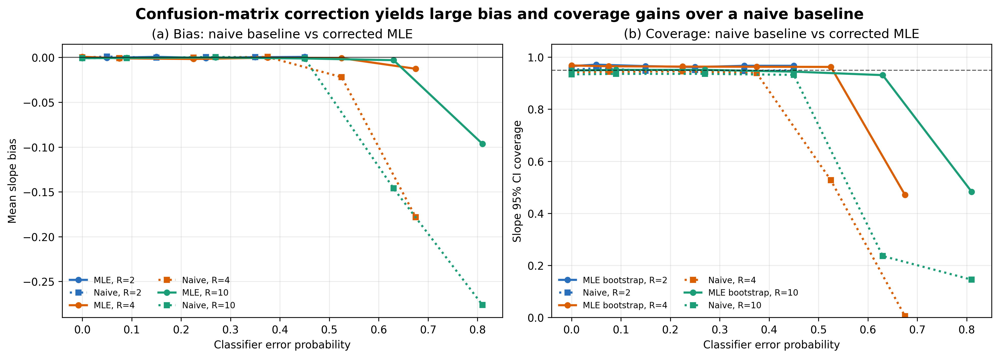

# Correcting Machine-Learned Regime Misclassification in Switching Regressions

Aleksandr Michuda

Draft v2: 2026-04-28

## Abstract

Machine-learning classifiers are increasingly used to assign observations to economic states, locations, demographic groups, and other regimes that are then used in downstream regressions. When predicted regimes are treated as true, classification error becomes an econometric measurement-error problem. This paper studies a switching-regression estimator that combines the classifier's soft predictions with a confusion matrix to correct for misclassification in regime assignment. An EM-style iteratively reweighted least squares (IRLS) routine provides stable starting values, and full maximum likelihood provides standard errors and confidence intervals. In a 72-cell Monte Carlo with 200 replications per cell (153,600 parameter-replication rows), the corrected estimator delivers near-nominal coverage under moderate classifier error: averaging over cells with misclassification weight at most 0.7, slope coverage is 0.936 for analytical Wald intervals and 0.959 for score wild bootstrap intervals. A naive hard-classification baseline matches the corrected estimator for two-regime designs but fails dramatically as regime count grows: at four regimes with the highest misclassification weight, naive 95 percent coverage is 0.001 versus corrected bootstrap coverage 0.471; at ten regimes, naive coverage is 0.145 versus 0.483. The correction therefore produces large finite-sample gains exactly where applied work most needs them, while remaining unnecessary in low-regime, well-classified problems.

## 1. Introduction

Machine-learning predictions increasingly enter empirical economics as intermediate data products rather than as final objects of interest. A researcher may predict ethnicity from names, occupations from text, neighborhoods from geocodes, or platform-worker locations from noisy digital traces. These predictions are then used to define treatment status, subgroup membership, or the regime in which a structural relationship is estimated. This workflow converts unstructured data into econometric variables, but it also creates a familiar problem in a new form: the regressor or regime indicator is measured with error.

This paper studies that problem for switching regressions. The motivating setting is a panel in which each unit belongs to one latent regime, and the slope of an outcome on a regime-specific shock differs across regimes. The econometrician does not observe the true regime. Instead, a classifier produces a soft probability vector over predicted regimes, and validation data provide a confusion matrix. The question is how to use those objects in a regression model without pretending that predicted labels are true labels.

The proposed approach is direct. The classifier probabilities and the confusion matrix imply, for each unit, a probability distribution over latent true regimes. Those probabilities enter a finite-mixture switching-regression likelihood. The estimator first runs an EM-style IRLS routine, which alternates between posterior regime weights and weighted least-squares coefficient updates. It then uses the IRLS solution to initialize a full maximum-likelihood estimator. The maximum-likelihood step is the primary estimator because it delivers likelihood-based standard errors and supports score wild bootstrap inference clustered at the unit level.

The paper is simulation-only. The simulation design is calibrated to the structure of a ride-hailing application in which workers respond to region-specific weather shocks and region assignment may be inferred from machine-learning predictions. The goal is not to re-estimate that application here. Instead, the goal is to document when the classifier-informed likelihood behaves well, when it does not, and how it compares to the naive practice of treating modal classifier predictions as true regime labels. This is the practical decision an applied researcher faces before using a classifier-generated regime variable in a switching regression.

The paper makes three contributions. First, the corrected likelihood delivers near-nominal coverage under moderate classifier error: for misclassification weights at most 0.7, slope coverage is 0.936 (Wald) and 0.959 (score wild bootstrap), averaged across regime counts and shock correlations. Second, the correction generates large bias and coverage gains over a naive hard-classification baseline in many-regime designs: at four regimes with the highest misclassification weight, naive coverage collapses to 0.001 while corrected bootstrap coverage holds at 0.471, and at ten regimes the analogous numbers are 0.145 versus 0.483. Third, the correction is unnecessary at two regimes: naive coverage matches the corrected estimator across the entire misclassification grid because the modal class remains correct on a majority of observations even when the classifier is noisy. The implication for applied work is that the correction matters most precisely where prediction-based research is moving fastest, namely many-category classifications generated by modern ML pipelines.

The paper contributes to three literatures. First, it builds on the switching-regression tradition beginning with Quandt (1972), Goldfeld and Quandt (1973), and Hamilton (1989), but treats regime information as coming from an external classifier rather than from an entirely latent transition process. Second, it connects to the econometric literature on misclassification, including Aigner (1973), Bollinger (1996), Mahajan (2006), Lewbel (2007), and the identification framework of Hu (2008). Third, it fits into the modern post-machine-learning econometrics agenda surveyed by Athey and Imbens (2019) and Mullainathan and Spiess (2017), and formalized in other contexts by Chernozhukov et al. (2018). The distinctive feature here is that the machine-learning object is a predicted latent regime, and the downstream model is a switching regression.

The rest of the paper proceeds as follows. Section 2 presents the model, identification, and the mapping from classifier output to latent-regime probabilities. Section 3 describes estimation and inference. Section 4 lays out the Monte Carlo design. Section 5 presents the simulation results. Section 6 discusses practical implications and limitations. Section 7 concludes.

## 2. Model

Consider a panel indexed by units `i = 1, ..., N` and time periods `t = 1, ..., T`. Each unit belongs to one latent regime `r_i` in `{0, ..., R - 1}`. In the motivating application, regimes can be interpreted as geographic or demographic groups inferred from noisy information. The econometric relationship of interest is regime specific:

```math
y_{it} = alpha_{r_i} + beta_{r_i} x_{r_i, t} + epsilon_{it},
```

where `x_{rt}` is the shock relevant for regime `r`, `alpha_r` and `beta_r` are regime-specific parameters, and `epsilon_{it}` is an idiosyncratic error. The simulation uses a common error variance across regimes. The key econometric problem is that `r_i` is not observed.

Instead of observing the true regime, the econometrician observes the output of a classifier. Let `p_i` denote the classifier's soft probability vector over predicted regimes. Its `j`th element is the classifier's probability that unit `i` is predicted to be in class `j`. The classifier is imperfect, but suppose validation data or a known simulation design provide a confusion matrix. The matrix `mw` is row-stochastic, with element `mw[k, j] = P(predicted = j | true = k)`. The estimator uses the column-normalized version:

```math
cm[k, j] = P(true = k | predicted = j).
```

Combining the soft predicted probabilities with this column-normalized confusion matrix gives a probability over true regimes for each unit:

```math
w_i(k) = sum_j p_i(j) cm[k, j].
```

These `w_i(k)` are not estimated inside the regression. They are precomputed from classifier output and validation-data error rates. The switching regression then treats true regime membership as latent but probabilistically informed by the classifier.

A modeling assumption matters here: regime membership is fixed within unit. The simulation design generates one true regime per unit and uses it across all observations of that unit. Under this assumption, the appropriate likelihood marginalizes over the unit's latent regime after multiplying the unit's time-series likelihood contributions. For unit `i`, the likelihood is

```math
L_i(theta) = sum_{r=0}^{R-1} w_i(r) prod_{t=1}^{T_i} f(y_{it} | alpha_r + beta_r x_{rt}, sigma),
```

where `theta` collects all regime-specific coefficients and the common scale parameter, and `f(· | mu, sigma)` is the Gaussian density. This driver-level likelihood differs from an observation-level mixture likelihood that would allow the same unit to switch regimes across periods. The simulation harness passes driver identifiers into the estimator so the likelihood respects the fixed-regime panel structure. Applications in which true regime can switch within unit (occupation transitions, location transitions over a long panel) require an observation-level mixture; the driver-level form here is appropriate when the classifier targets a stable attribute such as ethnicity, fixed location, or persistent skill type.

### 2.1 Identification

Three quantities determine whether the regime-specific coefficients are identified in finite samples. First, the classifier weights `w_i(·)` must vary across units. If every unit has the same `w_i(·)` vector, the likelihood cannot separate regime-specific intercepts and slopes from a common mean. In practice, this requires that the classifier is informative enough that different units receive materially different posterior regime probabilities. Second, the regime-specific covariates `x_{rt}` must have nontrivial within-cell variation; if `x_{rt}` is highly correlated across regimes, the likelihood has limited independent variation with which to distinguish regime-specific slopes. Third, the regime count `R` interacts with classifier informativeness: a fixed misclassification weight implies different correct-class probabilities across `R`, and identification weakens roughly with the inverse of the gap between the highest and second-highest entries of `cm`. Section 4 shows that these three forces drive the coverage and bias patterns in the simulation.

The model highlights the role of the classifier. If the classifier is highly informative, `w_i(k)` is concentrated near the true regime, and the likelihood is close to the complete-data likelihood. If the classifier is uninformative, `w_i(k)` becomes diffuse, and the model must distinguish regimes using outcome patterns and regime-specific shocks alone. The Monte Carlo evidence below is organized around this signal-strength dimension.

## 3. Estimation and Inference

The estimator uses two computational steps. The first is an EM-style IRLS algorithm. Given current parameter values, the E-step computes posterior probabilities that each unit belongs to each regime. Given those posterior probabilities, the M-step solves weighted least-squares problems for the regime-specific regression coefficients and updates the common variance. This routine is fast and stable, making it useful for initialization.

The second step is full maximum likelihood. The IRLS estimates are stacked into a starting vector for the likelihood optimizer. The MLE is the paper's primary estimator because it directly optimizes the observed-data likelihood and provides a Hessian-based covariance estimate. The implementation also computes score wild bootstrap intervals, clustering at the independent unit level to respect the fixed-regime panel structure.

This division of labor matters. IRLS is not presented as a separate preferred estimator; it is an algorithmic bridge to the MLE. As Section 5.3 reports, IRLS and MLE produce nearly identical point-estimate RMSE across the entire design. The practical value of the MLE is therefore inference: it delivers standard errors and confidence intervals that can be evaluated in coverage experiments.

Two confidence intervals are evaluated. The first is the analytical Wald interval based on the MLE standard error. The second is a score wild bootstrap interval. The bootstrap is designed to be robust to clustered score contributions and is especially relevant because the latent regime is fixed at the unit level. In the figures and tables below, coverage is computed for slope coefficients, which are the main objects of interest.

Section 5 also reports a naive hard-classification baseline that does not use the confusion matrix. Each unit is assigned to its modal predicted regime, and OLS is run separately by predicted regime with cluster-robust standard errors clustered at the unit level. This baseline is the natural comparator for applied work that treats classifier output as if it were a categorical label, and the corresponding implementation is in `paper-writer/scripts/run_naive_baseline.py`.

## 4. Monte Carlo Design

Each Monte Carlo replication generates a panel with 200 units and 15 time periods, giving 3,000 observations per replication. The number of latent regimes is `R in {2, 4, 10}`. True intercepts and slopes vary by regime: for two regimes, the true slopes are 3.0 and -2.0; for four regimes, they are 3.0, -2.0, 1.5, and -1.0; for ten regimes, they range linearly from 3.0 to -2.0. The error standard deviation is one in every regime.

Classifier quality is governed by a misclassification weight `w in {0.0, 0.1, 0.3, 0.5, 0.7, 0.9}`. When `w = 0`, the classifier is perfect. As `w` rises, probability mass moves from the true class to incorrect classes. The mapping from weight to correct-class probability is

```math
P(correct) = 1 - w (1 - 1/R).
```

This mapping matters because the same `w` implies different signal levels for different numbers of regimes. At `w = 0.9`, correct-class probability is 0.55 for two regimes, 0.325 for four regimes, and 0.19 for ten regimes. The high-weight many-regime cells are therefore extreme weak-classifier stress tests that only become extreme as `R` grows.

The design also varies the equicorrelation among regime-specific shocks, `rho in {0.0, 0.3, 0.6, 0.9}`. Correlated shocks make regime-specific slopes harder to distinguish, which is the second identification threat from Section 2.1. A high-correlation, high-misclassification, many-regime cell is therefore the hardest case for the estimator.

The full factorial yields 72 design cells: three regime counts, six misclassification weights, and four shock correlations. Each cell has 200 replications, producing 153,600 parameter-replication rows in total. Each replication records IRLS estimates, MLE estimates, naive hard-classification estimates, analytical standard errors, score wild bootstrap intervals, naive cluster-robust standard errors, convergence indicators, and runtime. The generated paper artifacts are reproducible from `paper-writer/scripts/generate_simulation_evidence.py`. Exact table versions are in Appendix Tables A0-A3.

## 5. Results

### 5.1 Coverage of the corrected estimator

Figure 1 is the main coverage result. It plots, for each regime count, the gap between empirical coverage and the 0.95 target. The left column reports analytical Wald coverage, and the right column reports score wild bootstrap coverage. Each heatmap varies misclassification weight on the horizontal axis and shock correlation on the vertical axis.


The first finding is that coverage is close to nominal through a wide middle range of the design. For cells with `w <= 0.7`, average slope coverage is 0.936 for analytical Wald intervals and 0.959 for score wild bootstrap intervals. This holds despite variation in regime count and shock correlation. The bootstrap is slightly conservative on average, which is visible in several cells with coverage above 0.95.

The second finding is that coverage failure is concentrated in extreme high-misclassification, many-regime cells. Across all design cells, average analytical Wald coverage is 0.884 and average bootstrap coverage is 0.906. The drop from the moderate-design averages is driven primarily by `w = 0.9`. Averaging over regime counts and correlations, bootstrap coverage is 0.640 at `w = 0.9`, compared with at least 0.953 for each lower weight.

The third finding is that two-regime designs remain well behaved even at high `w`. With `R = 2` and `rho = 0`, bootstrap coverage ranges from 0.948 to 0.982 across the misclassification grid. At `R = 2`, even `w = 0.9` leaves correct-class probability at 0.55, so the classifier is noisy but not essentially useless. By contrast, at `R = 4` and `w = 0.9`, correct-class probability is 0.325; at `R = 10`, it is 0.19. The coverage collapse in these cells (Section 5.1 paragraph 5; cross-referenced by Figure 5 below) is therefore an identification warning about high-dimensional regime models with weak classifiers.

The hardest cells are instructive. With `R = 4`, `rho = 0.9`, and `w = 0.9`, analytical Wald coverage is 0.138 and bootstrap coverage is 0.142. With `R = 10`, `rho = 0.9`, and `w = 0.9`, analytical Wald coverage is 0.230 and bootstrap coverage is 0.242. In these designs, the classifier provides little information and the shocks are highly correlated, so the likelihood has limited independent variation with which to distinguish regimes.

### 5.2 Naive hard-classification baseline

Figure 5 compares the corrected MLE to a naive hard-classification baseline that assigns each unit to its modal predicted regime and estimates regime-specific OLS with cluster-robust standard errors. Panel (a) plots mean slope bias against classifier error probability for both estimators across regime counts. Panel (b) plots the corresponding 95 percent CI coverage.



Three findings stand out.

First, the corrected estimator and the naive baseline are nearly indistinguishable for two-regime designs. At `R = 2` with `w = 0.9`, naive coverage averages 0.955 versus corrected bootstrap coverage 0.960. Naive RMSE and slope bias also track the corrected estimator across the entire two-regime grid. This is intuitive: at `R = 2`, the modal predicted class remains correct on a majority of units even at the highest misclassification weight, so hard classification recovers approximately the right subsamples and OLS within each subsample is nearly unbiased.

Second, the gap between the two estimators opens dramatically at `R = 4` and `R = 10`. At `R = 4` with `w = 0.9`, naive 95 percent coverage averages 0.001 across shock correlations, while corrected bootstrap coverage averages 0.471. At `R = 10` with `w = 0.9`, naive coverage averages 0.145 versus corrected 0.483. The naive estimator's mean absolute slope bias rises from 0.032 at `R = 4`, `w <= 0.7` to 1.825 at `R = 4`, `w = 0.9`. The corresponding corrected MLE bias is 0.032 and 1.533. Both estimators are stressed in the hardest cells, but only the naive baseline produces near-zero coverage.

Third, the correction's payoff is monotone in regime count. For each fixed misclassification weight, the naive-versus-corrected gap is wider at `R = 10` than at `R = 4`, and wider at `R = 4` than at `R = 2`. This is the central practical implication of the simulation: the correction matters most in exactly the settings where ML-prediction-based research is moving fastest, namely many-category classifications generated by modern pipelines.

The asymmetry across regime counts has a simple interpretation. In binary problems, the modal class is correct whenever correct-class probability exceeds 0.5, so naive estimation recovers approximately the right partition even when the classifier is noisy. In many-regime problems, the modal class is wrong on a large share of observations once correct-class probability falls below `1/R + epsilon`, so naive estimation pools the wrong observations within each predicted regime and inherits classification error as bias and undercoverage. The likelihood correction routes around this by reweighting every unit by its full posterior over true regimes, which preserves identification as long as the posteriors vary across units.

### 5.3 RMSE, bias, and the IRLS-MLE near-identity

Figure 2 summarizes point-estimate accuracy. It plots slope RMSE against classifier error probability, separating panels by shock correlation and lines by estimator and regime count.


The RMSE pattern mirrors the coverage result. In moderate designs, the estimator is accurate. For `w <= 0.7`, mean MLE slope RMSE is 0.029 for `R = 2`, 0.041 for `R = 4`, and 0.092 for `R = 10`. These values increase with regime count, as expected, but they remain small relative to the range of true slopes in the simulation.

At `w = 0.9`, RMSE rises sharply for the high-regime designs. With no shock correlation, MLE slope RMSE is 0.913 for `R = 4` and 1.268 for `R = 10`. With shock correlation 0.9, MLE slope RMSE is 3.357 for `R = 4` and 2.520 for `R = 10`. The fact that these failures appear in both RMSE and coverage is useful: the problem is not a standard-error calibration issue. It is a weak-classification problem that affects point estimation directly.

The most instructive secondary finding is that IRLS and MLE are nearly indistinguishable in the RMSE frontier. Across all 72 design cells, mean slope RMSE is 0.264 for IRLS and 0.263 for MLE. This is unexpected given the substantial conceptual gap between the two estimators: IRLS optimizes a sequence of weighted least-squares problems, while MLE optimizes the observed-data likelihood directly. The implication for applied work is that IRLS is not just a useful initializer; it is a useful diagnostic, and any disagreement between IRLS and MLE point estimates would itself be a flag for misspecification or weak identification. The MLE remains the primary estimator in this paper because it provides the inference objects evaluated in Section 5.1.

Figure 3 focuses on the baseline two-regime, uncorrelated-shock design. It shows the distribution of MLE slope errors across the misclassification grid.


The distributions remain centered near zero. This visual is important because it explains why coverage remains strong in the two-regime design. Misclassification increases uncertainty, but with enough classifier signal and a correctly specified confusion matrix, it does not necessarily introduce systematic slope bias in the corrected likelihood estimator.

### 5.4 Computation and convergence

Figure 4 reports computational feasibility. It plots mean runtime per replication for IRLS, MLE, and the score wild bootstrap, and it reports convergence by regime count.


The estimator is computationally feasible at the current simulation scale, but runtime grows quickly with the number of regimes. Mean MLE time is 0.135 seconds for `R = 2`, 0.597 seconds for `R = 4`, and 6.315 seconds for `R = 10`. The score wild bootstrap adds additional cost, with mean times of 0.121, 0.435, and 3.448 seconds for two, four, and ten regimes, respectively.

Convergence remains high. The mean convergence rate is 0.998 for `R = 2`, 0.995 for `R = 4`, and 0.984 for `R = 10`. The major limitation in the hardest cells is therefore not optimizer failure. It is weak information about regime membership when the classifier is nearly uninformative and the regression design is difficult.

## 6. Discussion

The simulation supports four practical implications.

First, applied researchers should use soft classifier output rather than hard predicted labels whenever the regime count exceeds two. The naive comparison in Section 5.2 shows that hard classification works for two regimes but fails badly as `R` grows. The likelihood correction depends on the full probability vector and the confusion matrix, and collapsing a classifier to its modal class discards the information about uncertainty that the correction relies on. In many-category prediction problems generated by modern ML pipelines, the difference is the difference between near-zero coverage and approximately-correct coverage at high misclassification.

Second, validation data are not optional. The confusion matrix is the bridge between predicted regimes and true regimes. In applications, it must come from labeled validation data, a credible audit sample, or another defensible calibration source. The simulation here uses the true confusion matrix; realistic applications will use an estimated one, and a stronger version of this paper would perturb the confusion matrix in a robustness simulation. That extension is left for future work, but the dependence is real and applied users should plan for it.

Third, researchers should report classifier signal in a way that is meaningful for the number of regimes. The simulation shows why the raw misclassification weight is not enough. A high error rate in a two-regime problem is different from the same weight in a ten-regime problem. Reporting implied correct-class probabilities, classifier entropy, or other measures of classification informativeness should be standard in applications using predicted regimes.

Fourth, IRLS-MLE agreement is itself diagnostic. The near-identity in Section 5.3 is unexpectedly tight, and it suggests that any future application in which IRLS and MLE point estimates disagree materially should be treated as a flag for misspecification, weak identification, or numerical pathology in the optimizer.

The simulation also has visible limitations. The current evidence assumes a known and correctly specified confusion matrix, fixes regime within unit, and uses a Gaussian outcome equation with common variance. Each restriction is defensible in the simulation context but should be relaxed before pushing the method into applied use. Misspecified confusion matrices, validation-sample noise in the confusion matrix, regime switching within unit across periods, and heterogeneous variance across regimes are all natural extensions. They would move the paper closer to applied practice, where the classifier is estimated, the validation sample may be small, and the latent regime structure may not match a stylized DGP.

The high-misclassification failures should be treated as a feature of the evidence rather than an embarrassment. The estimator should not be expected to identify many regime-specific slopes when classifier probabilities are nearly uniform and shocks are highly correlated. The useful contribution is to show where the boundary is. In moderate designs, the method works well and dominates naive estimation; in weak-classifier many-regime designs, it warns the researcher not to overfit heterogeneity that the data cannot support.

## 7. Conclusion

This paper studies a switching-regression estimator for settings in which latent regime membership is measured by a noisy machine-learning classifier. The estimator combines soft classifier probabilities with a confusion matrix, uses IRLS for initialization, and estimates the model by full maximum likelihood. In a 72-cell Monte Carlo, the estimator delivers near-nominal coverage under moderate misclassification, large bias and coverage gains over a naive hard-classification baseline in many-regime settings, and high convergence rates across regime counts.

The headline finding is that the correction is consequential where applied research is moving fastest. In two-regime problems, the naive baseline matches the corrected estimator and the practical case for the correction is weak. In four- and ten-regime problems, the naive baseline collapses while the corrected estimator continues to deliver usable coverage until the classifier becomes nearly uninformative. The correction therefore solves the empirical problem most likely to face researchers using modern multi-category classifiers as inputs to switching regressions.

A second lesson is that machine-learning predictions can be used productively in switching regressions, but only if their uncertainty is carried into the econometric model. Soft probabilities and confusion matrices are not ancillary classifier diagnostics; they are part of the regression likelihood. When the classifier retains signal, the correction produces reliable estimates and inference. When the classifier is nearly uninformative in a many-regime setting, the likelihood cannot manufacture identification, and the simulation makes that boundary visible.

For applied work, the recommendation is straightforward: do not treat predicted regimes as truth. Use the classifier's full probability vector, calibrate the confusion matrix, report classifier signal, and stress-test inference as the number of regimes grows. The simulation evidence here provides a first map of when that workflow is reliable and a quantitative reason to abandon naive hard-classification estimation in many-category settings.

## Appendix: Tables

The appendix tables are generated by `paper-writer/scripts/generate_simulation_evidence.py` and stored under `paper-writer/results/tables/`.

### Table A0: Design summary

Source files: `table_A0_design_summary.csv` and `table_A0_design_summary.tex`.

### Table A1: Performance by design cell

Source files: `table_A1_performance_all_cells.csv` and `table_A1_performance_rho_0_6.tex`. The CSV includes naive hard-classification estimator rows alongside MLE and IRLS rows.

### Table A2: Coverage by design cell

Source files: `table_A2_coverage_all_cells.csv` and `table_A2_coverage_rho_0_6.tex`. Both files include the naive coverage column added in v2.

### Table A3: Convergence and timing

Source files: `table_A3_convergence_timing_all_cells.csv` and `table_A3_timing_by_regime_weight.tex`.

Approximate word count: 4,050 words.
